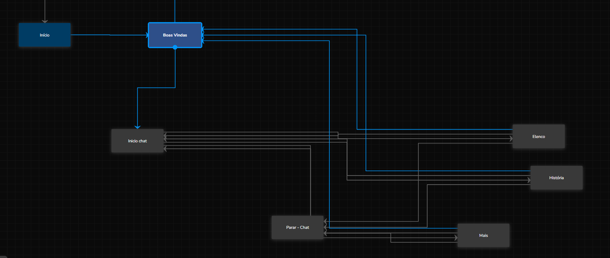
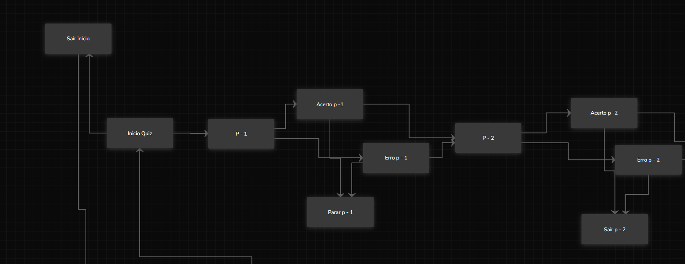
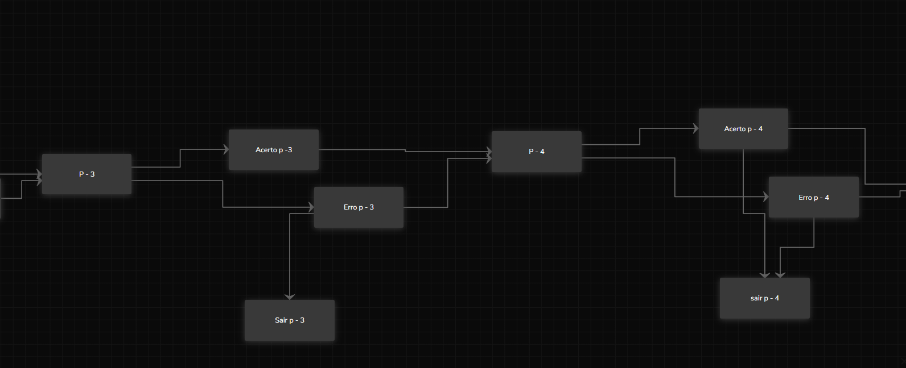
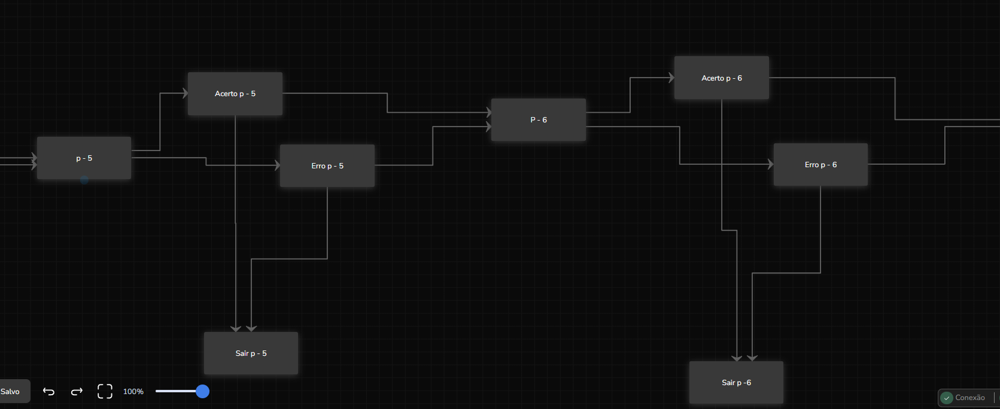
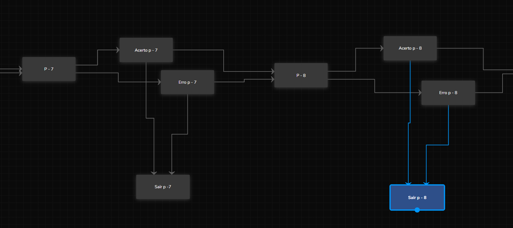
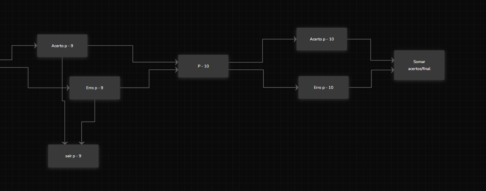
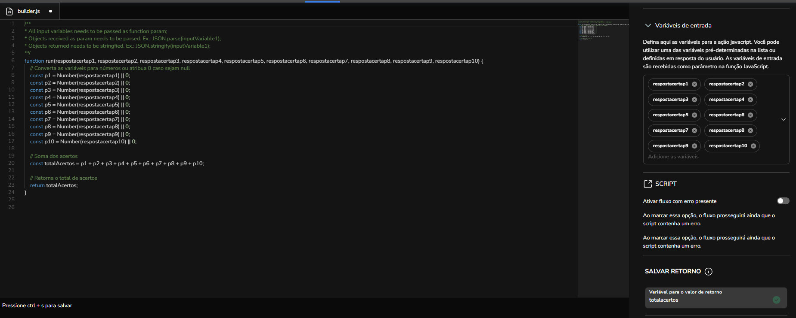

# FLuxo do Chatbot no Blip 🗯️
**O propósito deste chatbot é fortalecer a conexão entre os fãs e o time de Counter-Strike da FURIA, proporcionando uma experiência interativa e envolvente. Ele oferece informações exclusivas sobre o time, estatísticas e novidades, além de promover a interação por meio de quizzes dinâmicos. Ao testar seus conhecimentos sobre a equipe, os usuários são incentivados a se aproximar ainda mais do universo da FURIA, sendo recompensados com códigos exclusivos para sorteios e premiações especiais.**

- **Início do Chat:** Início do fluxo conversacional, no qual acontece a apresentação e introdução do chat.

---

- **Início do Quiz:** Início do fluxo do Quiz, onde existem as perguntas, com mensagens de acertos e erros personalizadas sobre o assunto, com o objetivo de testar e  ensinar o fã sobre o time.

---

- **Continuação das perguntas:**

---

- **Finalização do Quiz:** Final do Quiz, juntamente com o bloco de premiação.

---

- **Script da lógica que conta a pontuação do Quiz:** Script localizado no bloco 'Somar acertos/final' no qual realiza a contagem de acertos do usuario no quiz.

## Teste 💬

- Para testar acesse:
🔗 [**Pantera Virtual - Página Interativa**](https://mbdomingues.github.io/PanteraVirtual/)