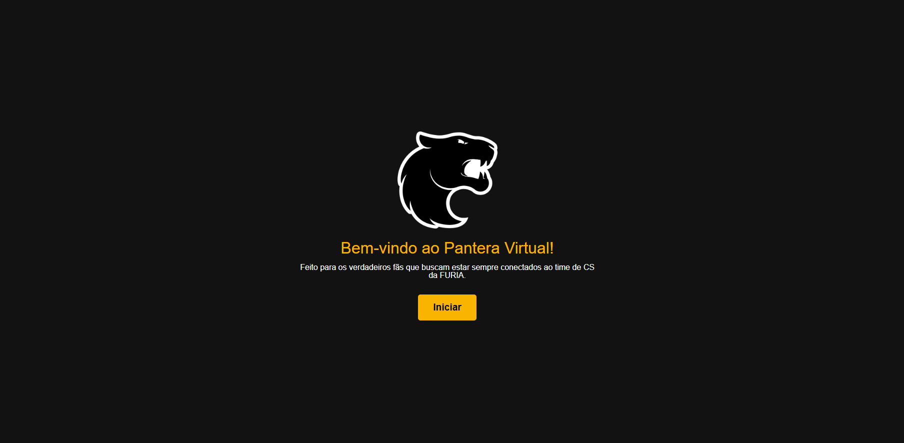
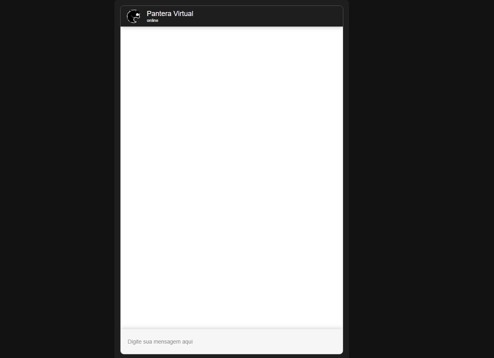

# 🐾 Pantera Virtual

O **Pantera Virtual** é um projeto desenvolvido para aproximar os fãs do time de Counter-Strike da FURIA. Ele consiste em uma **página web interativa** integrada com um **chatbot no Blip**, oferecendo uma experiência única para os verdadeiros admiradores da equipe.

## 🚀 Funcionalidades

- **🌐 Página Web Responsiva** – Interface moderna e estilizada para os fãs da FURIA.

- **🎟️ Gerador de Códigos de Premiação** – Os usuários podem receber códigos únicos para sorteios e premiações especiais após a realização do quiz sobre o time.

- **🤖 Chatbot Inteligente** – Integração com Blip para interações dinâmicas e personalizadas com o chatbot **Pantera Virtual**.

## 🛠️ Tecnologias Utilizadas

O projeto foi desenvolvido utilizando as seguintes tecnologias:

- 🔹 **Blip** – Chatbot interativo para interação com os fãs.

## Telas da Página 💻

## 🌐 Demonstração

Acesse a versão publicada do projeto clicando no link abaixo:

🔗 [**Pantera Virtual - Página Interativa**](https://mbdomingues.github.io/PanteraVirtual/)